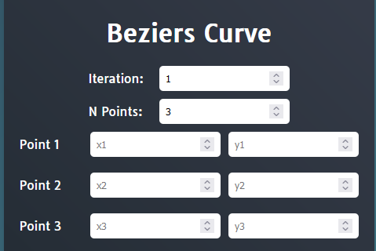

# Bezier Curve Solver

## Description

A program designed to solve a Bezier Curve with given control points with a Divide and Conquer Algoritm and Brute Force Algorithm. This program allows user to enter a series of control points and iterations desired, and will return series of points of the solved Bezier Curve with visualisation

## Installation

1. Clone the repository

```cmd
git clone https://github.com/TazakiN/Tucil2_13522032_13522043.git
```

2. Navigate to the project directory

```cmd
cd Tucil2_13522032_13522043
cd src
```

3. Install the dependencies

```cmd
npm install
```

## Usage Guide

1. Start the local server

```cmd
npm start
```

2. Open your web browser and navigate to http://localhost.

3. You can now enter your desired iterasions and points, as well as customize settings on using Divide and Conquer or Brute Force Algoritm, showing each generated points coordinates, showing points on your curve, and showing the process on how the curve is made.




## Contributors

Created by [@TazkiaNizami](https://github.com/TazakiN), [@DanielManurung](https://github.com/Gryphuss)
